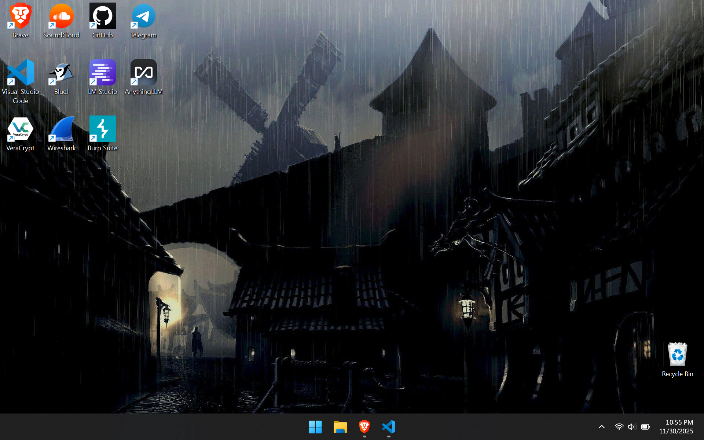

<link rel="stylesheet" href="/assets/css/custom.css">

# ThinkPad T14 Gen 6 - Snapdragon
About a week ago I got a new laptop. This specific laptop I have been searching for about 3 months for a reasonable price. In the end, I ended up buying it for 1300. It's a laptop that I appreciate so much for its complex beauty. I really could talk a long time about it but I will try to summarize it as best as I could into a couple categories/rating.
The ThinkPad is sturdy while also being thin. With 0 keyboard flex, it's a high-end ultrabook. I have no issues with the keyboard layout, other than the Copilot button and some other Windows-related buttons.
There are 2 USB and 2 USB-C slots, along with a headphone jack, HDMI, and security jack. The only thing I would like is for a micro-SD slot.
The laptop has the following features: fingerprint reader, self-healing BIOS, microphone muter, camera close, light-up keyboard, low-energy screen and probably a lot more features that I am missing.
The screen is 60 Hz. The laptop came with a 120 Hz variant, but I wasn't happy with the price point of that one, and I found an absolutely steal that I will get to later.
The battery life is amazing for simple tasks. The laptop charges to 80 in an hour, and at 100%, it can last up to 20 hours on just simple web browsing and other tasks. When doing other tasks (coding, AI, etc.) the battery varies. If the task is high CPU/NPU reliant, battery life can vary even from 2–4 hours. If it's coding of the sort, etc., it can last around 12 hours. The laptop comes with an inbuilt mode button to toggle between Windows battery mode.
Now it's the juicy stuff. The hardware is so unbelievable for the price. The Snapdragon X Elite X1E78-100 is listed on LaptopMedia as the #30 best laptop CPU currently on the market. And for a good reason. When people hear Snapdragon they usually don't think much of performance, but it's exceptional. The laptop also has incredibly fast 8500 MHz 32 GB soldered RAM. The Hexagon NPU, under the correct tests, is actually slower (in my cases) than the CPU with LMs, but it is much more efficient. With a loss of 1–2 tops, the battery life extends over 2–4 hours depending on the model. Lenovo has this laptop listed as 1800 on their website, as an ultrabook. I managed to find a good price on Amazon for 1350.
After fully setting up the laptop, this is what the laptop looked like.

A clean Windows 11 Pro install, with all of the telemetry features disabled, and to my liking. With nothing open, the CPU idles at 0%, and doing simple tasks the CPU doesn't pass 25%.
I have had almost no ARM-based problems yet. I also haven't tested the GPU much. I ran some simple password-cracking tests and it performed decently. I would like to test gaming in the future.

If this laptop holds up well, I might stick to Snapdragon processors for a while. I have also been looking into the new X2 processors they have coming out in the first half of 2026, and they look incredibly interesting, especially with the promise of a new and improved GPU gen.
